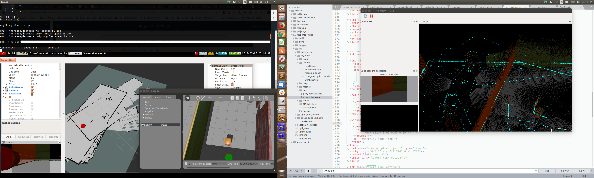
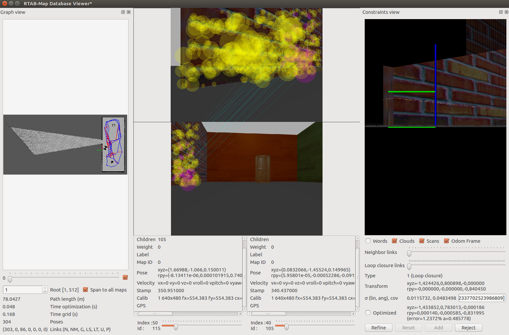

# Rtab Map World

Based on previous [WhereAmI](https://github.com/scooler/where_am_i) Robot

This one uses rtabmap to do SLAM

## Screenshots

Images can be found under [/images/rtabmap](./images/rtabmap). With rtabmap I made just 2:

- 
- 

## Build

To build just run
```
catkin_make
```

In the main directory. That should create devel directory. So then `source devel/setup.bash` (or `.zsh` if that's your fancy ;) ).


## Run - Mapping

In order to run:
1) start the world - `roslaunch my_robot world.launch`
2) start the teleop `rosrun teleop_twist_keyboard teleop_twist_keyboard.py`
3) start localization with rtabmap `roslaunch my_robot mapping.launch`
4) drive robot with keyboard on teleop

Have fun !