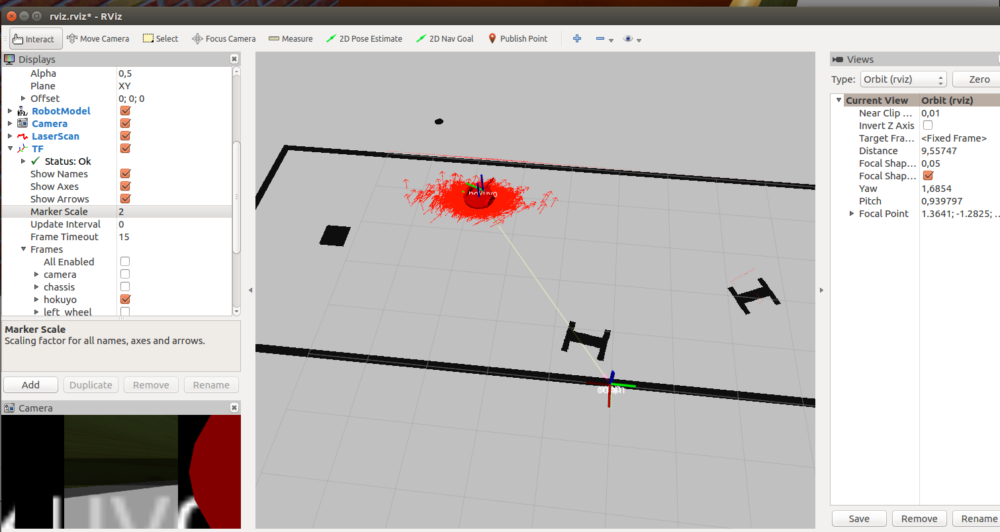

## Description to the screen shots

### Run 1

The 1st run I was like YAY ! IT WORKS ! Pose Array visualizes the particles very nicely. :+1:

Only now looking back I see that the "cloud of particles" was pretty big. That's BEFORE any tuning.

-----------------

### Run 2

The map wasn't related properly to odom frame, so on screenshot1 particles are cast pretty wide - MCL is pretty confused XD.

But once map is more in place it gets more narrow. I've also started tunning (with the `update_min_a` as default of PI/6 - aka 30deg seems pretty big)

-----------------

### Run 3 (or something :sweat:)

Similar to how it happens in Run 2 - if map isn't in place particles tend to "behave"

But once it snaps in place - they look nice:

-----------------

### Run n

By whatever run - the particles cloud is pretty narrow (as compared to the run1 - FOR SURE). However still some odd one shows up (as on screenshot 1)

